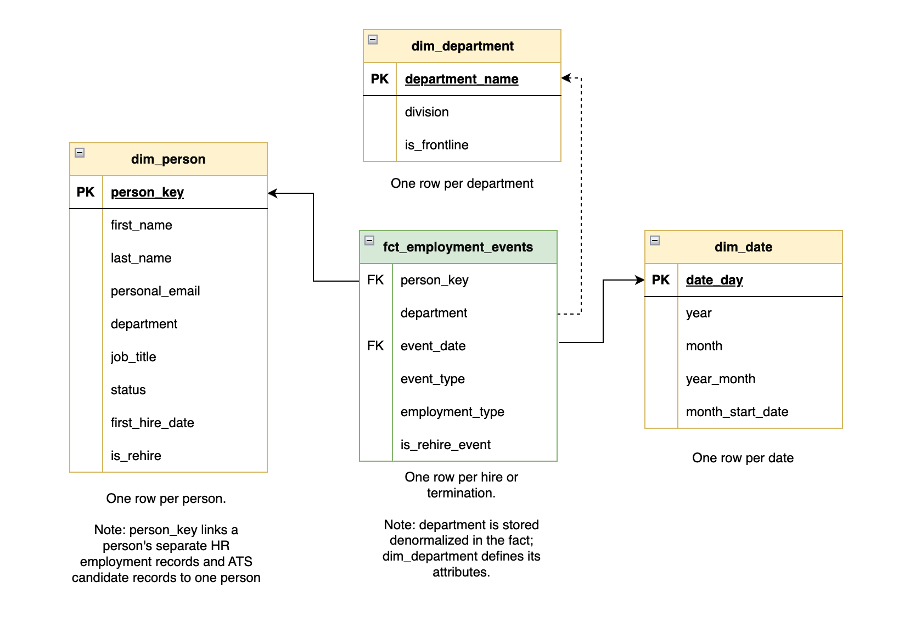

# Northline Outfitters People Analytics Pipeline

An analytics engineering project that solves a problem every HR team has. Two systems both track people, and neither one knows what a person is. This pipeline generates synthetic HR and recruiting data every day, loads it into a warehouse, resolves it into a single record per person, and serves a dashboard answering headcount and turnover questions the source systems cannot answer alone.

[View the live dashboard](https://datastudio.google.com/s/r_Lk8rb8nA8) · [Read the full writeup](https://github.com/justinduckett/portfolio/blob/main/people-analytics.md)

## Architecture


The pipeline runs once a day. GitHub Actions triggers it on a schedule, Prefect orchestrates the tasks and reports run history and logs to Prefect Cloud, and dbt Core builds and tests the models in BigQuery.

## The problem this solves

Northline Outfitters is a fictional Canadian outdoor retailer with about 190 employees. Its people data lives in two systems that were never designed to talk to each other:

- **PeopleCore (HRIS)** is the system of record for employment. It exports a nightly CSV, one row per employment record.
- **TalentFlow (ATS)** is the recruiting system. It exports JSON, one record per candidate, with applications nested inside.

Neither system counts people. PeopleCore counts employment records, so someone who leaves and is rehired shows up twice with two unrelated IDs. TalentFlow counts candidate profiles, most belonging to people who were never hired, and it knows people by self reported email and phone rather than an employee ID.

So a basic question like "how many people work here, and how many are returning employees" has no answer in either system. This pipeline builds that answer.

## Identity resolution

The core of the project. A `person_key` is built in two stages.

**Within the HR system**, employment records are linked by two rules:

1. Records sharing a personal email address are the same person.
2. Records with the same full name where the employment periods do not overlap, meaning one ended before the next began.

That second condition is the safeguard. Two employees named Sarah Lee working at the same time are different people, so records that overlap never merge. A missed link creates a duplicate someone might notice. A false merge deletes a person from the company's numbers and nobody notices at all.

**Across systems**, candidates are matched to employment records by three rules, in order:

1. Personal email match. This survives nicknames and married names, which is why it runs first.
2. Same full name plus a hired application with a start date within seven days of the employee's hire date. The date is the corroboration that makes name matching safe.
3. Shared phone number and full name, which links duplicate candidate records to each other.

Every match records which rules fired, so the reasoning can be checked rather than taken on faith. Candidates matching nothing keep a null key, which for the roughly 170 people who applied and were never hired is the correct answer.

## Data quality

Ten problems are deliberately planted in the source data. Each one is a realistic issue found in real HR systems, and each forces the pipeline to demonstrate a specific technique.

| ID | Problem | What the pipeline does |
|---|---|---|
| P01 | Sources arrive in different formats (CSV and nested JSON) | Staging models conform both into typed tables and unnest the JSON applications |
| P02 | No source table is one row per person | A canonical person record is built by resolving records across and within systems |
| P03 | Exports show current state only with no history | Snapshots capture changes over time into a slowly changing dimension |
| P04 | Rehired employees get a new ID with nothing linking the two records | Identity resolution links them by shared email or by same name with sequential employment |
| P05 | One person exists as two candidate records in the recruiting system | Deduplication by matching name and standardized phone number |
| P06 | Names differ between systems (nicknames and married names) | Matching leads with email so it survives any name change |
| P07 | Two different employees share a name and get colliding work emails | Concurrent same name records are never merged and a uniqueness test enforces it |
| P08 | Department names drift across spellings and casing | A mapping table standardizes them with a test that fails on unmapped values |
| P09 | Phone numbers and emails arrive in inconsistent formats | Standardized in staging before any matching runs |
| P10 | A candidate marked hired never appears in the HR system | The HR system is treated as the system of record for employment |

Every dbt build runs automated tests covering primary keys, null checks, accepted values, and an assertion that no candidate is ever matched to two different people. The department mapping test earns its keep most often, because it fails the build the moment the source system produces a spelling nobody has seen before, instead of letting a blank department reach the dashboard.

## The dimensional model



Two star schemas share the same dimensions.

**Employment events** records one row per hire and one per termination. It connects to `dim_person`, `dim_date`, and `dim_department`. Events can be counted over any period safely.

**Headcount** records one row per day per department per employment type. This one is different: it can be added up across departments but never across dates, because that counts the same person once for every day they worked. Two smaller tables are built from it, one for month end trends and one for the current day, so the dashboard cannot make that mistake.

A dbt snapshot captures changes over time. When someone transfers departments, the old version of their record is closed with an end date and a new version opens. This is what makes point in time questions answerable, since the source exports only ever show the present.

## Design decisions and limitations

**Rebuilt history versus recorded history.** The headcount tables rebuild the full history from hire and termination dates on every run, so a missed week costs nothing. The snapshot is different: it only knows what it saw on the days it ran. The dashboard is built entirely on the rebuilt tables for that reason, and the snapshot stands as a demonstration of the pattern rather than a chart source.

**Department is stored in the facts, not joined.** `dim_department` defines the attributes (division, whether the department is frontline), but the fact tables carry the department name directly. This avoids pushing a join into the BI layer for eight values that never change. If departments later gained cost centres or regions, a proper key based join would be the right move.

**Synthetic data is designed, not sampled.** Every data problem here exists because it was planted, so the pipeline was built already knowing what it had to catch. Real source profiling is the harder version of this work. A separate ground truth file records the true identity of every person, which is what makes it possible to verify the pipeline reached the right answer rather than a plausible one.

**Headcount counts employment records, not people.** For a rehired employee, two employment periods are two separate contributions to headcount over time, which is correct. Person level counts come from `dim_person`.

## Lessons learned the hard way

**Never add up a daily snapshot across dates.** The first version of the dashboard reported 284,814 employees. The table stores a headcount for each day, so adding it across every day counted each person once per day they worked. The fix was building purpose designed tables underneath it, rather than trusting the BI tool to be configured correctly.

**A documented reason that overstates its evidence is worse than none.** The identity resolution originally labelled every record with an email as an email match, including records whose email was shared with nobody. The keys were right, but the explanation was not. Filtering to genuinely shared emails made the column honest.

**Change one thing at a time in test data.** An early version of the nickname test person was also a rehire, so a failed match would have had two possible causes. Each planted problem now sits on its own person.

**Environment variables do not survive a closed terminal.** The credential path was set per session and silently vanished between working sessions, producing a confusing wall of retries. Moving it into the shell profile fixed it, and the credential inventory now records every place that references the key.

## How to run

Clone the repo and create a virtual environment:

```
python3 -m venv .venv && source .venv/bin/activate
pip install -r requirements.txt
```

Add a GCP service account key as `gcp-key.json` in the project root (never committed, see `.gitignore`) and point the environment at it:

```
export GOOGLE_APPLICATION_CREDENTIALS="$PWD/gcp-key.json"
```

dbt reads its connection settings from `dbt/northline_hr/profiles.yml`, which picks up the keyfile path from that same environment variable. Update the project ID and location there to match your own BigQuery setup.

Run the full pipeline once:

```
python ingestion/flow.py
```

This generates both source exports for today's date, loads them into the `hr_raw` dataset, then runs `dbt build`, which executes seeds, models, snapshots, and tests in dependency order.

To register the flow with Prefect Cloud and trigger runs from its UI:

```
python ingestion/flow.py serve
```

### Scheduled runs

`.github/workflows/daily_pipeline.yml` runs the pipeline every day at 11:00 UTC. GitHub Actions is only the trigger; Prefect still orchestrates the tasks and reports to Prefect Cloud. It needs three repository secrets: `GCP_SA_KEY`, `PREFECT_API_KEY`, and `PREFECT_API_URL`.

## Project structure

```
generators/     synthetic source systems and the ground truth they render
ingestion/      Prefect flow: generate, load, transform
dbt/            dbt Core project (staging, intermediate, marts, snapshots)
docs/           source system design, decisions log, credential inventory
.github/        scheduled workflow that triggers the daily run
```

## Links

- [Live dashboard](https://datastudio.google.com/s/r_Lk8rb8nA8)
- [Portfolio writeup](https://github.com/justinduckett/portfolio/blob/main/people-analytics.md)